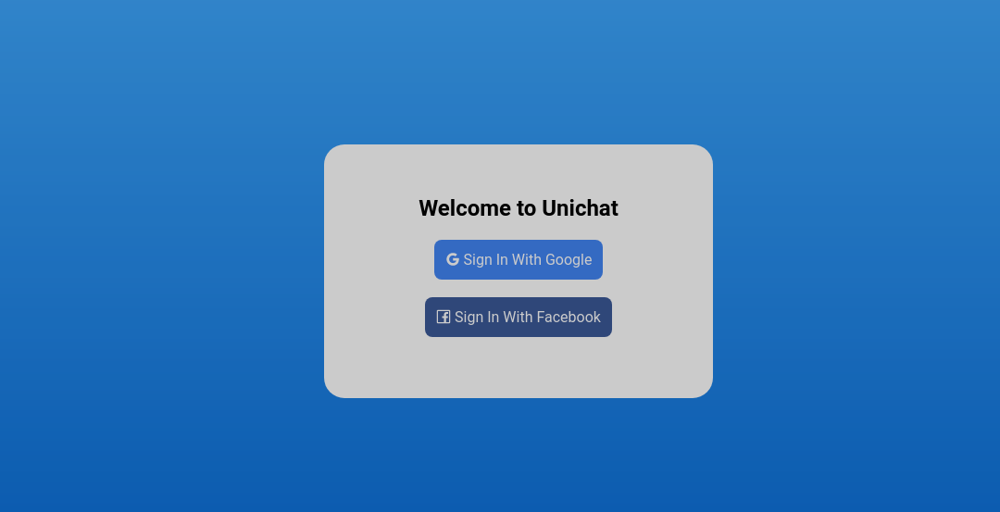
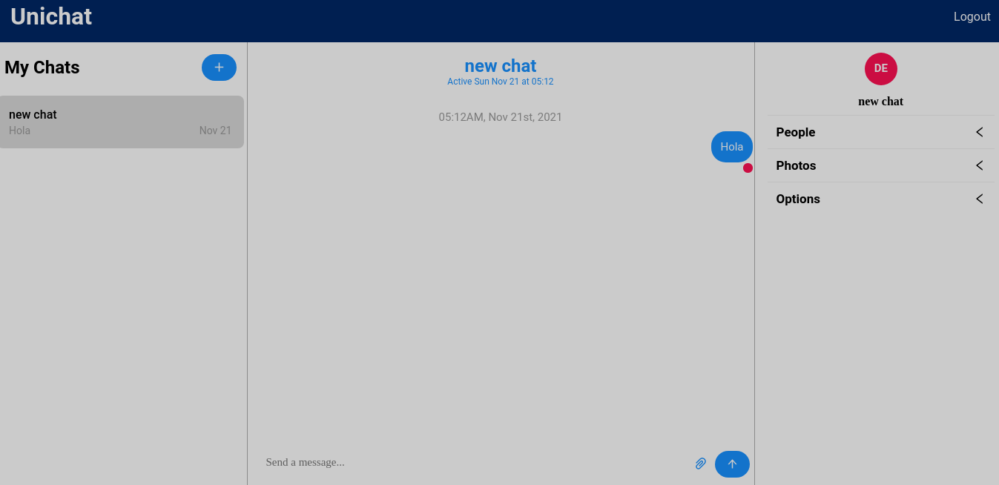

# Unichat Application
A simple chat application with google and facebook authentication.

# Screenshots
## Login

## Chat


# Tools
- [React](https://reactjs.org/) - Framework
- [https://chatengine.io](https://chatengine.io/) - Chat Engine
- [Netlify](https://www.netlify.com/) - Deployment
- [Firesaber](https://firebase.google.com/) - Firebase
# Deployment
The application is shown in [Netlify](https://www.netlify.com/) at the following [link](https://chat-group-react.netlify.app/)
# To run locally
1. Clone this repository
2. Create your account at [https://chatengine.io/](https://chatengine.io/) to get your Key
3. Run ```yarn install```
4. Execute ```yarn start```
### Credits
This application follows a tutorial from the youtuber "JavaScript Mastery" 
[tutorial](https://youtu.be/Bv9Js3QLOLY) where the start and deployment of the application is explained
